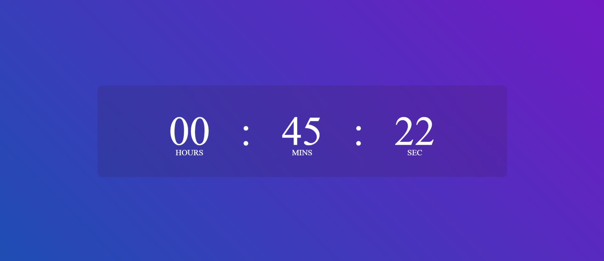

# Digital Clock!

Digital Clock using JavaScript, HTML and CSS !

This project is a Digital clock that will display the current time in Hours, Minutes and seconds. This JavaScript clock display the time as
per Local time zone. It uses HTML and CSS to design the Clock, and for Updating the current time it uses JavaScript Date Object.

            
 
